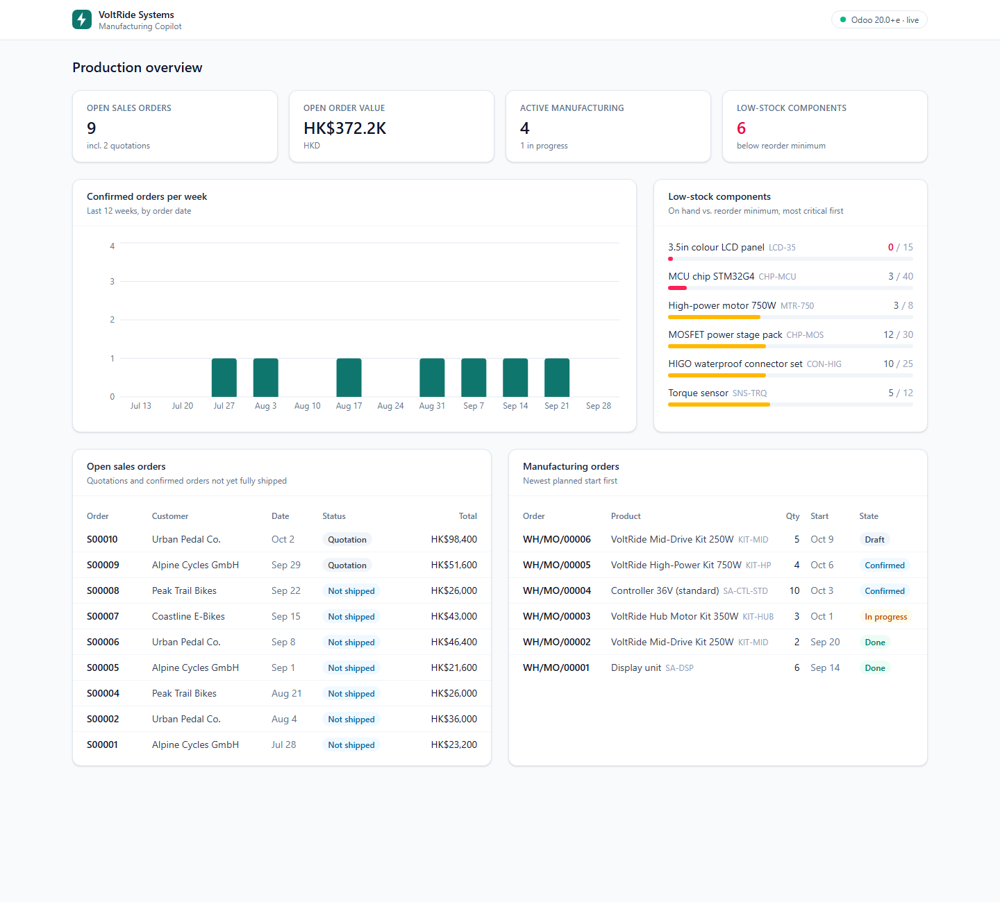
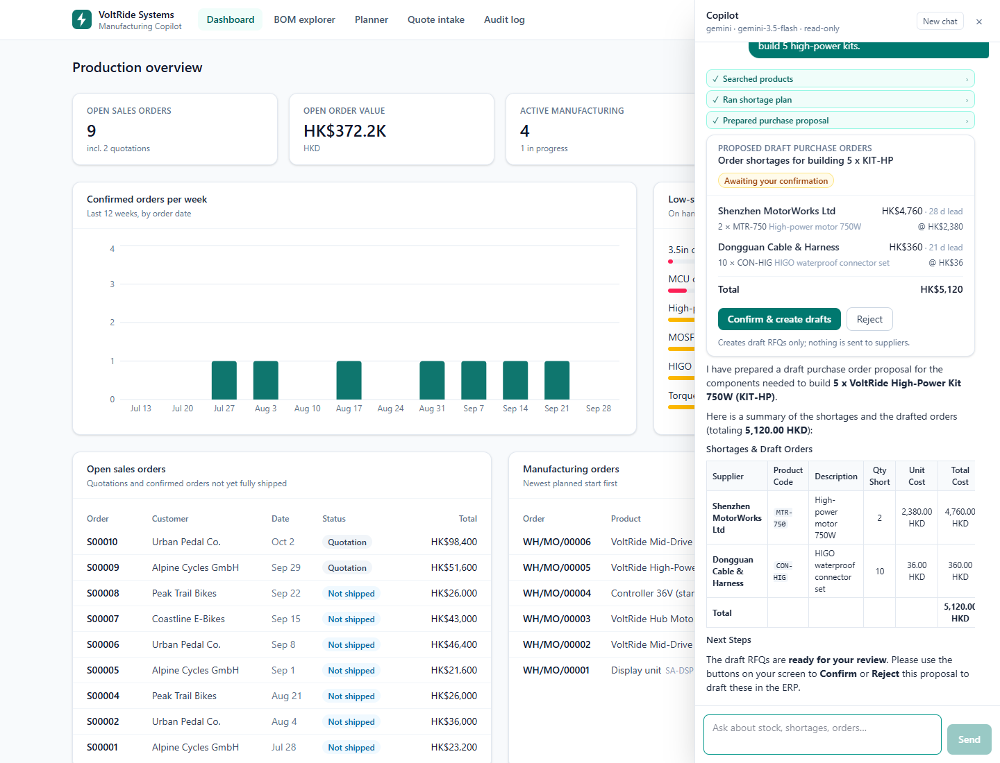
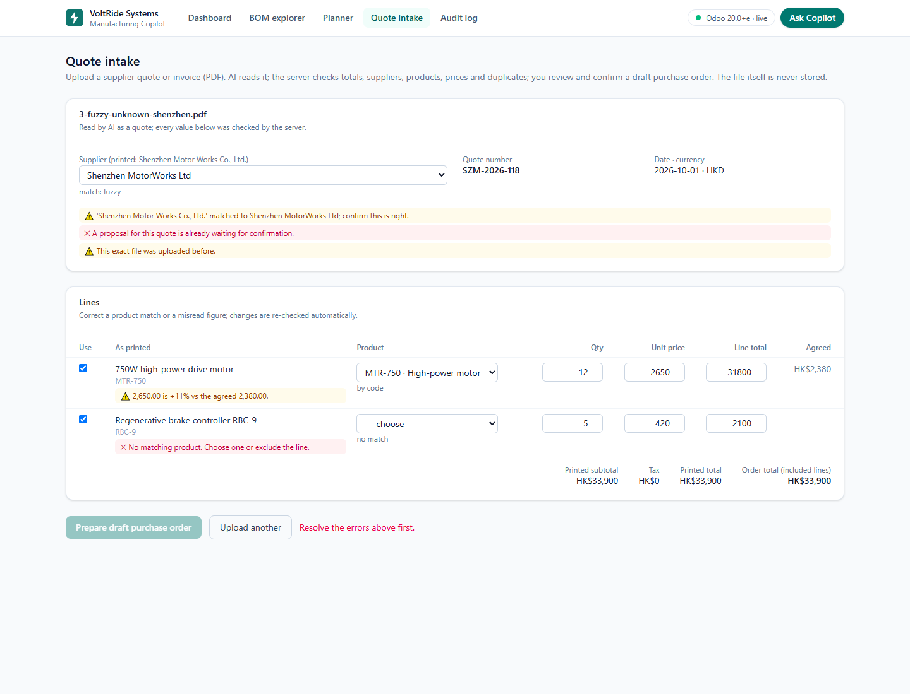
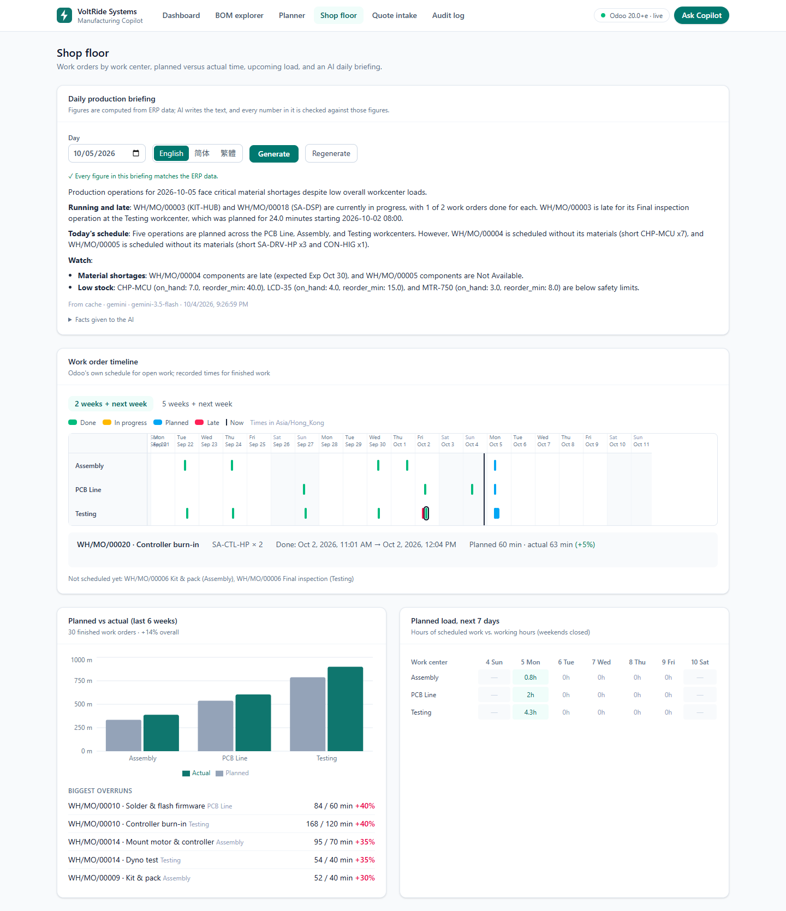
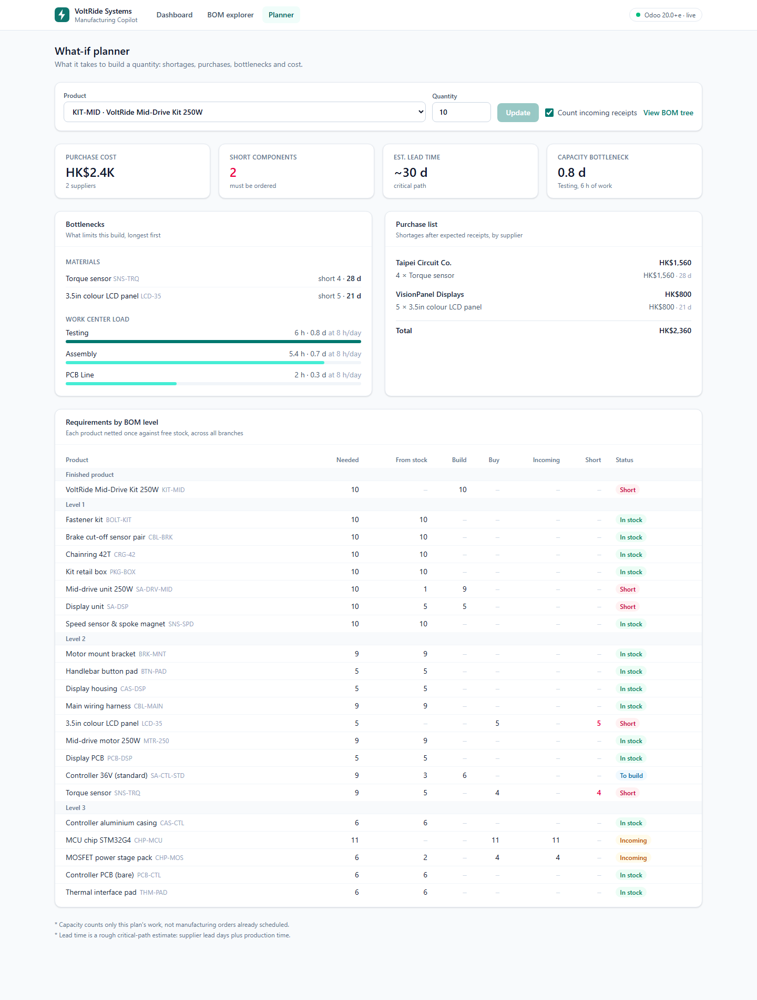
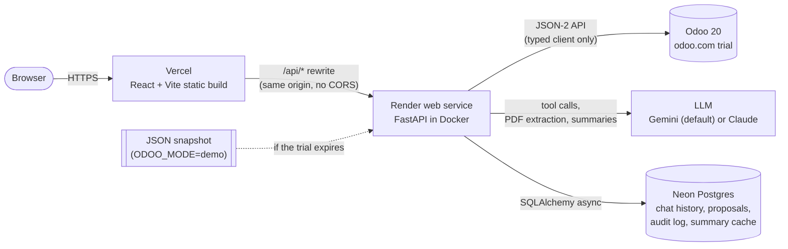
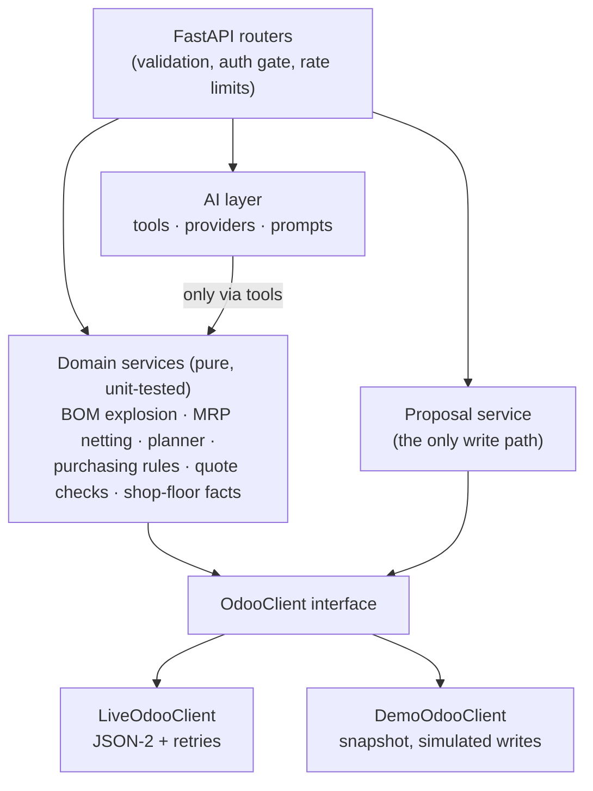

# VoltRide Manufacturing Copilot

An AI-assisted manufacturing app on top of **Odoo**, built for a fictional e-bike
drive-system maker, VoltRide Systems. It shows production at a glance, explodes
multi-level bills of materials, plans builds against live stock, and adds an AI
assistant that reads ERP data through **typed, validated tools**. Writes go only
through **proposals a person confirms**, and reading supplier quotes and writing
production briefings come with **deterministic checks**.

**Live demo:** _LIVE_URL_ · AI features need the demo password (ask the author).
The first visit after a quiet period shows "Waking up the server" for 30–60 s
while the free-tier API starts.



## What it does

| Area | What you can do |
|---|---|
| **Dashboard** | Open sales orders, manufacturing orders, low-stock components, confirmed orders per week |
| **BOM explorer** | Multi-level BOM tree (React Flow) with stock, rolled-up cost and shortage status per part; opens on the paths that lead to shortages |
| **What-if planner** | "Build N of X": MRP netting against *free* stock, purchase list by supplier, material and work-center bottlenecks, lead-time estimate |
| **AI assistant** | Questions in English or Chinese, answered from live ERP data through 8 tools; can *propose* draft purchase orders |
| **Quote intake** | Upload a supplier PDF: AI reads it, code checks it, you review and confirm a draft PO |
| **Shop floor** | Work-order timeline per work center, planned vs actual time, 7-day load, AI daily briefing |
| **Audit log** | Every tool call, proposal, decision, extraction and summary, append-only |

| | |
|---|---|
|  |  |
|  |  |

## Architecture



Inside the back end, everything goes through one layer:



## AI safety design

The LLM is treated as untrusted input at every boundary.

1. **No raw ERP access.** The model can call only the tools in
   [`backend/app/ai/tools.py`](backend/app/ai/tools.py), each a narrow
   question answered through the `OdooClient` interface. There is no generic
   "search any model" tool. (Odoo 20's own MCP server offers exactly that
   generic access; this project deliberately does not.)
2. **Validated arguments.** Every tool's input is a Pydantic model with
   `extra="forbid"`. Its JSON schema is what the model sees, and the raw
   arguments are validated against it again before anything runs. Invalid,
   ambiguous or unknown inputs come back to the model as readable errors it can
   correct, for example "'chip' matches several products: …".
3. **Writes need a human.** `draft_purchase_orders` only *builds a proposal*.
   It is stored, the model is told explicitly that nothing was created, and the
   user sees Confirm / Reject. Confirm is a separate endpoint the model cannot
   reach. Before writing, the server:
   - checks ownership and a 30-minute expiry;
   - claims the proposal atomically (`pending → executing`), so double clicks
     write once;
   - re-validates it against current ERP data;
   - creates **draft** RFQs only, with deterministic origins, so a retry after
     a partial failure never duplicates.
4. **The model reads; code decides.** For supplier PDFs the model only
   extracts a typed `ExtractedQuote`. Arithmetic, supplier and product
   matching, price deviation, currency and duplicate checks are plain,
   unit-tested Python, and the user's corrections are re-checked server-side.
5. **Grounded summaries.** The daily briefing is written from facts computed
   in code. Every number in the generated text is traced back to those facts,
   and untraceable figures are shown to the user as a warning.
6. **Replay-safe history.** Conversations store each provider's messages
   verbatim (Gemini thought signatures, Claude thinking blocks), because both
   APIs reject altered history.
7. **Audit and limits.** Everything above is written to an append-only audit
   log. The public demo adds a password gate (signed, expiring tokens),
   per-IP and global rate limits on LLM calls, and a round cap on tool loops.

## Tech stack

**Front end:** React 19, TypeScript, Vite, Tailwind CSS 4, TanStack Query, React Router, React Flow + dagre, Recharts.
**Back end:** Python 3.12, FastAPI, Pydantic 2, SQLAlchemy 2 (async, asyncpg), Alembic, httpx.
**AI:** a provider interface with an OpenAI-compatible adapter (Google Gemini by default, also Hugging Face router or Groq) and an Anthropic adapter (Claude).
**Infra:** Vercel, Render (Docker), Neon Postgres, Odoo 20 (odoo.com).

```
backend/   FastAPI app (api, odoo, services, ai, models, schemas), Alembic migrations,
           scripts (check_odoo, seed_odoo, export_snapshot, make_sample_quotes), tests
frontend/  React app (pages, components, typed API client), vercel.json
docs/      screenshots
```

## Running locally

Needs Python 3.12+ and Node 20+. Copy `.env.example` to `.env` and fill in the
Odoo URL, database, login and API key (Odoo: avatar → My Preferences → Account
Security → New API Key), a `DATABASE_URL` (any Postgres, for example a Neon
branch), and `GEMINI_API_KEY` (free from Google AI Studio) or `ANTHROPIC_API_KEY`.

```bash
cd backend
python -m venv .venv && source .venv/bin/activate      # Windows: .venv\Scripts\activate
pip install -r requirements-dev.txt
python scripts/check_odoo.py        # connection, version, protocol, read and write access
python -m scripts.seed_odoo         # populate Odoo (idempotent: safe to re-run)
uvicorn app.main:app --reload       # http://localhost:8000/docs (migrations run at startup)
pytest && ruff check .

cd ../frontend
npm install
npm run dev                         # http://localhost:5173, proxies /api to :8000
```

Without Odoo, set `ODOO_MODE=demo`: the app serves
`backend/app/odoo/snapshot/voltride.json`, shifts its dates to stay current,
and simulates writes. Refresh it with `python -m scripts.export_snapshot`.

## Deploying

**Back end (Render, free Docker web service).** `render.yaml` is a Blueprint:
in Render choose *New → Blueprint*, pick this repository, and enter the
secrets it asks for (`ODOO_URL`, `ODOO_DB`, `ODOO_USER`, `ODOO_API_KEY`,
`DATABASE_URL`, `DATABASE_URL_UNPOOLED`, `GEMINI_API_KEY`, `DEMO_PASSWORD`;
`AUTH_SECRET` is generated). The free instance sleeps after 15 idle minutes,
which the front end's "waking up" screen covers. The image runs as an
unprivileged user, listens on `$PORT`, applies migrations at startup and
writes nothing to disk. (The spec named Hugging Face Spaces, but Docker Spaces
now need a paid plan; the same image runs there unchanged on port 7860.)

**Front end (Vercel).** Import `frontend/` (framework: Vite). `vercel.json`
rewrites `/api/*` to the Render service's URL and serves `index.html` for
client-side routes, so the browser only ever talks to one origin.

**Database (Neon).** The deployed API uses the `production` branch; local
development uses a `dev` branch (`neon branches create --name dev`).

## Restoring onto a fresh Odoo trial

1. Create the trial with Sales, Inventory, Manufacturing and Purchase, then an
   API key for your user.
2. Update `ODOO_URL`, `ODOO_DB`, `ODOO_USER`, `ODOO_API_KEY` in `.env` (and the
   Render environment).
3. `python scripts/check_odoo.py`, then `python -m scripts.seed_odoo`.

The seed creates everything: suppliers, customers, 25 components, 5
sub-assemblies, 3 kits, multi-level BOMs with operations, stock with deliberate
shortages, reorder rules, purchase, sales and manufacturing orders (five weeks
of history, stock-neutral), and schedules open work with Odoo's own planner. If
the trial has already expired, switch to `ODOO_MODE=demo`.

## Things worth knowing about Odoo 20

Found by inspecting the live instance, not assumed:

- **API:** JSON-2 (`/json/2/<model>/<method>`, bearer key) is the API to build
  on; XML-RPC is deprecated.
- **Odoo Online rate limiting:** it returns HTTP 429, which is safe to retry
  even for writes. Timeouts and 5xx are retried only for reads, because a
  retried `create` could duplicate a record.
- **Data model changes:** Buy and Manufacture are warehouse-level routes, and
  `uom_po_id` and `workcenter.capacity` are gone.
- **Field reuse:** work orders hold planned *and* actual times in the same date
  fields, and Odoo rewrites a finished work order's expected duration; planned
  minutes are rebuilt from the BOM operation.
- **Odoo Online enterprise modules:** with `mrp_workorder` installed, starting a
  work order needs an HR employee; the seed avoids that path so it stays
  Community-compatible.

## Tests

`pytest` runs 237 tests with no external services: the domain logic with
fixtures, the Odoo client against mocked HTTP, providers against their SDKs' real
types, API endpoints on in-memory SQLite, and a check that the Alembic
migrations match the models. The front end is checked with `tsc`, oxlint and a
production build; flows were also exercised in headless Chrome.

## Limitations

- Capacity planning ignores work already scheduled, and weekends are closed.
- **The audit log is per browser:** it is scoped to an anonymous client id
  until real user accounts exist.
- **The free LLM tier can rate-limit.** Errors say when it resets, and the
  daily briefing is cached.
- **The odoo.com trial expires.** After that, the public demo switches to the
  snapshot.
